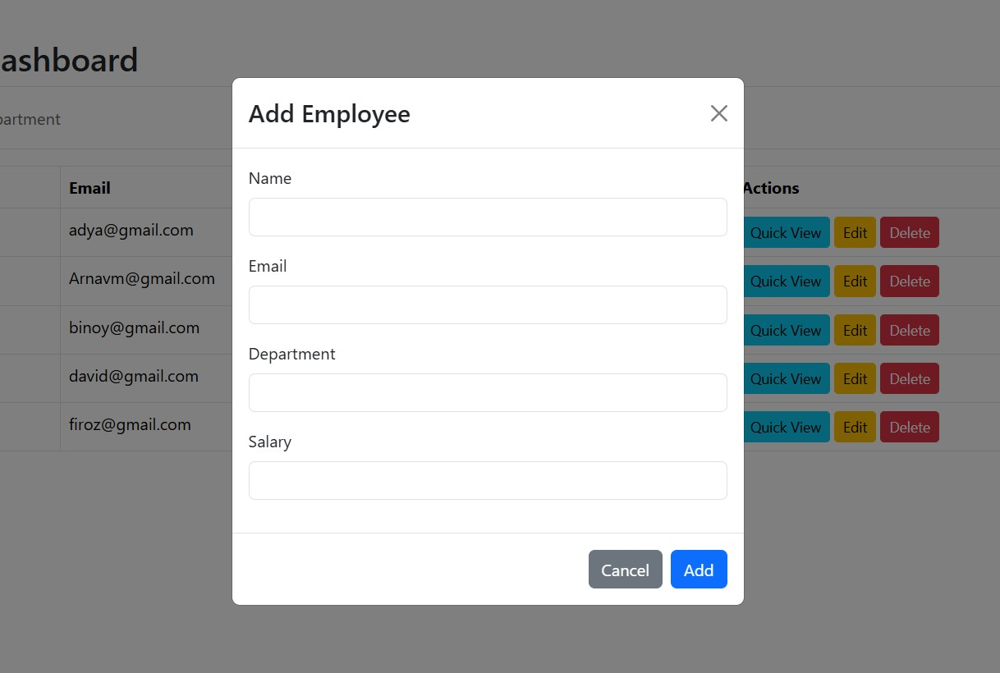
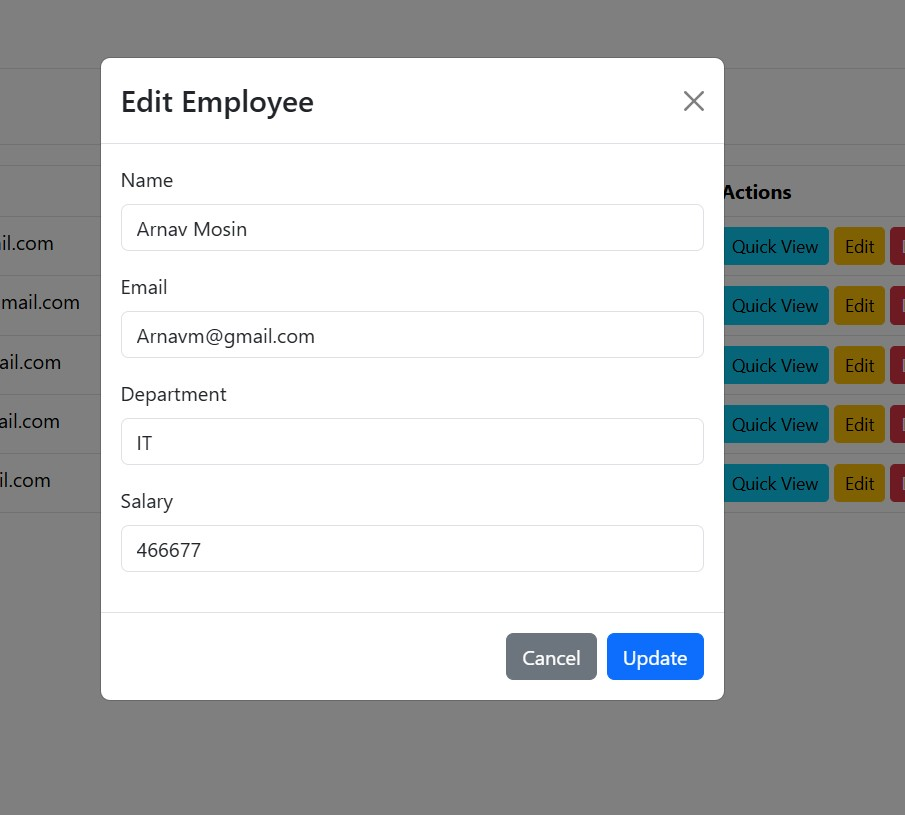

# 🧑‍💼 Employee CRUD App (React + ASP.NET Web API + SQL Server)

A full-stack **Employee Management System** built with **ASP.NET Web API**, **React.js**, and **SQL Server (Stored Procedures)**.  
It includes **login authentication**, **CRUD operations**  to visualize employee data.

---

## 🚀 Features

✅ User Login (Authentication)  
✅ View All Employees  
✅ Add, Edit, and Delete Employee Details  
✅ Search by Name or Department   
✅ Uses Stored Procedures for Database Operations  
✅ Clean, Responsive UI (Bootstrap)

---

## 🏗️ Project Structure

EmployeeProject/
│
├── EmployeeAPI/ ← ASP.NET Core Web API
│ ├── Controllers/
│ ├── Models/
│ ├── Repository/
│ ├── screenshots/
│ │ ├── Login.jpg
│ │ ├── Dashboard.jpg
│ │ ├── AddEmployee.jpg
│ │ └── EditEmployee.jpg
│ └── README.md
│
└── employee-dashboard/ ← React Frontend
├── src/
├── public/
├── package.json
└── README.md
---

## 🖼️ Application Screenshots

**Login Page**  
  

**Dashboard**  
  

**Add Employee**  
  

**Edit Employee**  
  

### 🔹 View Employee


---

## ⚙️ Technologies Used

### Backend
- **ASP.NET Core Web API** (.NET 6 or above)
- **SQL Server** (Stored Procedures)
- **Entity Framework Core**
- **C#**

### Frontend
- **React.js**
- **Axios** (for API calls)
- **Bootstrap 5**

---

## 🗄️ Database Setup

1. Create a database named `EmployeeDB`.
2. Add a table:
   ```sql
   CREATE TABLE Employees (
       EmployeeId INT IDENTITY(1,1) PRIMARY KEY,
       Name NVARCHAR(100),
       Email NVARCHAR(100),
       Department NVARCHAR(100),
       Salary DECIMAL(18,2)
   );
3. Create Procedures

CREATE PROCEDURE sp_GetEmployees
AS
BEGIN
    SELECT * FROM Employees;
END;
GO

CREATE PROCEDURE sp_AddEmployee
    @Name NVARCHAR(100),
    @Email NVARCHAR(100),
    @Department NVARCHAR(100),
    @Salary DECIMAL(18,2)
AS
BEGIN
    INSERT INTO Employees (Name, Email, Department, Salary)
    VALUES (@Name, @Email, @Department, @Salary);
END;
GO

CREATE PROCEDURE sp_UpdateEmployee
    @EmployeeId INT,
    @Name NVARCHAR(100),
    @Email NVARCHAR(100),
    @Department NVARCHAR(100),
    @Salary DECIMAL(18,2)
AS
BEGIN
    UPDATE Employees
    SET Name=@Name, Email=@Email, Department=@Department, Salary=@Salary
    WHERE EmployeeId=@EmployeeId;
END;
GO

CREATE PROCEDURE sp_DeleteEmployee
    @EmployeeId INT
AS
BEGIN
    DELETE FROM Employees WHERE EmployeeId=@EmployeeId;
END;
GO


⚡ API Endpoints
Method	Endpoint	Description
GET	/api/Employee	Get all employees
GET	/api/Employee/{id}	Get employee by ID
POST	/api/Employee	Add new employee
PUT	/api/Employee/{id}	Update employee
DELETE	/api/Employee/{id}	Delete employee
POST	/api/Auth/Login	User login

🧩 React Setup
1️⃣ Install dependencies
cd EmployeeReactApp
npm install

2️⃣ Run the React app
npm start

App runs at http://localhost:3000

🔧 Backend Setup (Web API)
1️⃣ Restore dependencies
cd EmployeeAPI
dotnet restore

2️⃣ Run the API
dotnet run


API runs at https://localhost:7280
