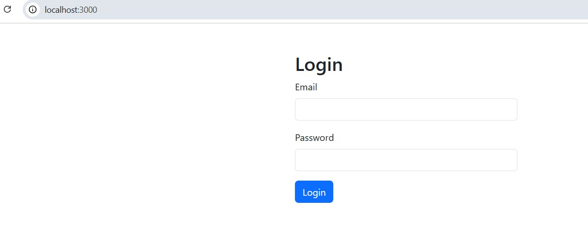
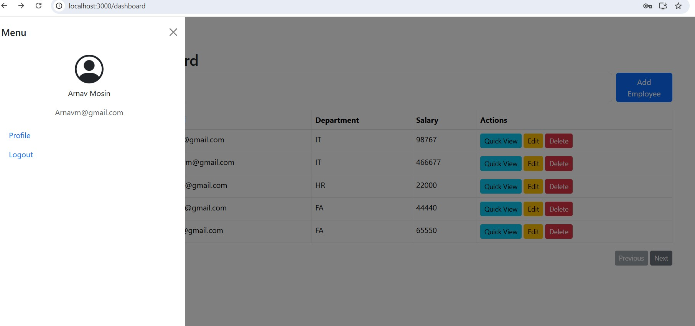
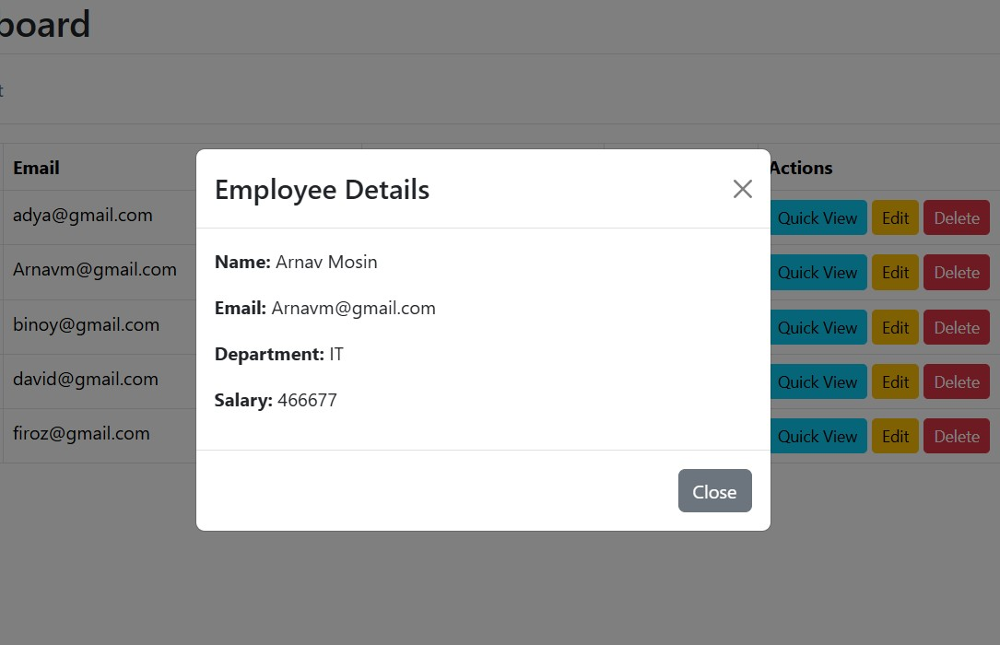

# 🧑‍💼 Employee CRUD App (React + ASP.NET Web API + SQL Server)

A full-stack **Employee Management System** built with **ASP.NET Web API**, **React.js**, and **SQL Server (Stored Procedures)**.  
It includes **login authentication**, **CRUD operations**  to visualize employee data.

---

## 🚀 Features

✅ User Login
✅ View All Employees  
✅ Add, Edit, and Delete Employee Details  
✅ Search by Name or Department   
✅ Uses Stored Procedures for Database Operations  
✅ Clean, Responsive UI (Bootstrap)

---


## 🖼️ Application Screenshots

**Login Page**  
  

**Dashboard**  
  

**Add Employee**  
  

**Edit Employee**  
  

### 🔹 View Employee


---

## ⚙️ Technologies Used

### Backend
- **ASP.NET Core Web API** (.NET 6 or above)
- **SQL Server** (Stored Procedures)
- **Entity Framework Core**
- **C#**

### Frontend
- **React.js**
- **Axios** (for API calls)
- **Bootstrap 5**

---

## 🗄️ Database Setup

## 1. Create a database named `EmployeeDB`.
## 2. Add a table:
   ```sql
   CREATE TABLE Employees (
       EmployeeId INT IDENTITY(1,1) PRIMARY KEY,
       Name NVARCHAR(100),
       Email NVARCHAR(100),
       Department NVARCHAR(100),
       Salary DECIMAL(18,2)
   );


##  Create Procedures
   
-- Get all employees
CREATE PROCEDURE sp_GetEmployees
AS
BEGIN
    SELECT * FROM Employees;
END;
GO

-- Add new employee
CREATE PROCEDURE sp_AddEmployee
    @Name NVARCHAR(100),
    @Email NVARCHAR(100),
    @Department NVARCHAR(100),
    @Salary DECIMAL(18,2)
AS
BEGIN
    INSERT INTO Employees (Name, Email, Department, Salary)
    VALUES (@Name, @Email, @Department, @Salary);
END;
GO

-- Update employee
CREATE PROCEDURE sp_UpdateEmployee
    @EmployeeId INT,
    @Name NVARCHAR(100),
    @Email NVARCHAR(100),
    @Department NVARCHAR(100),
    @Salary DECIMAL(18,2)
AS
BEGIN
    UPDATE Employees
    SET Name=@Name, Email=@Email, Department=@Department, Salary=@Salary
    WHERE EmployeeId=@EmployeeId;
END;
GO

-- Delete employee
CREATE PROCEDURE sp_DeleteEmployee
    @EmployeeId INT
AS
BEGIN
    DELETE FROM Employees
    WHERE EmployeeId=@EmployeeId;
END;
GO
---

## ⚡ API Endpoints

| Method | Endpoint           | Description        |
| ------ | ------------------ | ------------------ |
| GET    | /api/Employee      | Get all employees  |
| GET    | /api/Employee/{id} | Get employee by ID |
| POST   | /api/Employee      | Add new employee   |
| PUT    | /api/Employee/{id} | Update employee    |
| DELETE | /api/Employee/{id} | Delete employee    |
| POST   | /api/Auth/Login    | User login         |

---

## 🧩 React Setup

1️⃣ Install dependencies

cd EmployeeReactApp
npm install

2️⃣ Run the React app
    npm start
    
Open your browser at http://localhost:3000 to use the application.
---


